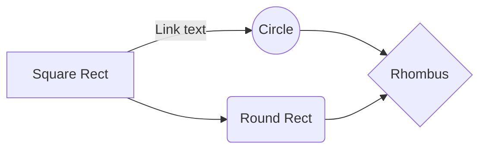

# Web application for renting housing
This project is aimed at those looking for new housing.
|Characteristic  |Positive                       |Negative                     |
|----------------|-------------------------------|-----------------------------|
|Single backticks|`'Isn't this fun?'`            |'Isn't this fun?'            |
|Quotes          |`"Isn't this fun?"`            |"Isn't this fun?"            |
|Dashes          |`-- is en-dash, --- is em-dash`|-- is en-dash, --- is em-dash|

It uses mathematical algorithms that are difficult to understand but easy to calculate:

$$
\Gamma(z) = \int_0^\infty t^{z-1}e^{-t}dt\,.
$$

I’m currently working on **gta 6**

# Installation instructions
To install, use 
```bash
python install.py
```
or
```bash 
pip install lalaleylo
```


# Ways of using the project

Scheme of effective use of my project:



# Credits 
wectorj

### Volodymyr Zelensky - Sponsor

Victor yanukovich - proffesor 

<h3 align="left">Languages and Tools:</h3>
<p align="left"> <a href="https://angular.io" target="_blank" rel="noreferrer">  Front-End 

</a> <a href="https://www.java.com" target="_blank" rel="noreferrer">   Back-End </a>  </p>

# License
Office of the President of Ukraine

# Support:
<p><a href="https://www.google.com"> </a></p><br><br>
<br><br>
<p align="center">All rights reserved</p>
