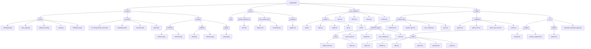

```mermaid
flowchart TD
  root[OVERVIEW]
  n_assets[[assets]]
  n_assets_fonts[[fonts]]
  n_assets_fonts_PixBobLite_png[PixBobLite.png]
  n_assets_fonts_ascii_sga_png[ascii_sga.png]
  n_assets_fonts_asciillager_png[asciillager.png]
  n_assets_fonts_default_font_png[default_font.png]
  n_assets_fonts_font_png[font.png]
  n_assets_sounds[[sounds]]
  n_assets_sounds_Its_Going_Down_Now_mp3[Its_Going_Down_Now.mp3]
  n_assets_sounds_Kingslayer_mp3[Kingslayer.mp3]
  n_assets_sounds_monster_mp3[monster.mp3]
  n_assets_sounds_pipe_mp3[pipe.mp3]
  n_assets_sprites[[sprites]]
  n_assets_sprites_enemies[[enemies]]
  n_assets_sprites_enemies_enemy1_png[enemy1.png]
  n_assets_sprites_enemies_enemy2_png[enemy2.png]
  n_assets_sprites_objects[[objects]]
  n_assets_sprites_objects_ship_png[ship.png]
  n_assets_sprites_objects_treasure_png[treasure.png]
  n_assets_sprites_player[[player]]
  n_assets_sprites_player_player_png[player.png]
  n_docs[[docs]]
  n_docs_adr[[adr]]
  n_docs_game_mechanics[[game_mechanics]]
  n_docs_game_mechanics_fsm_md[fsm.md]
  n_docs_lua_custom_libs[[lua_custom_libs]]
  n_docs_lua_custom_libs_Deque_md[Deque.md]
  n_docs_lua_custom_libs_Vector2d_md[Vector2d.md]
  n_docs_overview[[overview]]
  n_docs_overview_graph_md[graph.md]
  n_lua_modules[[lua_modules]]
  n_lua_modules_json_lua[json.lua]
  n_lua_modules_ltn12_lua[ltn12.lua]
  n_lua_modules_mime_lua[mime.lua]
  n_lua_modules_socket[[socket]]
  n_lua_modules_socket_lua[socket.lua]
  n_lua_modules_socket_ftp_lua[ftp.lua]
  n_lua_modules_socket_http_lua[http.lua]
  n_lua_modules_socket_smtp_lua[smtp.lua]
  n_lua_modules_socket_tp_lua[tp.lua]
  n_lua_modules_socket_url_lua[url.lua]
  n_scripts[[scripts]]
  n_scripts__rungame[[_rungame]]
  n_scripts__rungame_game_lua[game.lua]
  n_scripts__rungame_game_sfx_lua[game_sfx.lua]
  n_scripts__rungame_game_spr_tutor_lua[game_spr_tutor.lua]
  n_scripts__rungame_main_lua[main.lua]
  n_scripts__src[[_src]]
  n_scripts__src_enemy[[enemy]]
  n_scripts__src_enemy_enemy_lua[enemy.lua]
  n_scripts__src_enemy_enemy_spawner_lua[enemy_spawner.lua]
  n_scripts__src_enemy_states[[states]]
  n_scripts__src_enemy_states__state_lua[_state.lua]
  n_scripts__src_enemy_states_chase_lua[chase.lua]
  n_scripts__src_enemy_states_death_lua[death.lua]
  n_scripts__src_enemy_states_idle_lua[idle.lua]
  n_scripts__src_enemy_states_patrol_lua[patrol.lua]
  n_scripts__src_enemy_states_stunned_lua[stunned.lua]
  n_scripts__src_generate_mermaid_graph_py[generate_mermaid_graph.py]
  n_scripts__src_player[[player]]
  n_scripts__src_player_player_lua[player.lua]
  n_scripts_custom_libs[[custom_libs]]
  n_scripts_custom_libs_abstract_types[[abstract_types]]
  n_scripts_custom_libs_abstract_types_async_find_lua[async_find.lua]
  n_scripts_custom_libs_abstract_types_deque_lua[deque.lua]
  n_scripts_custom_libs_abstract_types_prior_deque_lua[prior_deque.lua]
  n_scripts_custom_libs_abstract_types_tests[[tests]]
  n_scripts_custom_libs_abstract_types_tests_deque_tests_lua[deque-tests.lua]
  n_scripts_custom_libs_abstract_types_tests_ideas_txt[ideas.txt]
  n_scripts_custom_libs_abstract_types_vec2_lua[vec2.lua]
  n_scripts_custom_libs_collisions_lua[collisions.lua]
  n_scripts_custom_libs_custom_libs_lua[custom_libs.lua]
  n_scripts_custom_libs_json_reader_lua[json_reader.lua]
  n_scripts_custom_libs_oop_lua[oop.lua]
  root --> n_assets
  root --> n_docs
  root --> n_lua_modules
  root --> n_scripts
  n_assets --> n_assets_fonts
  n_assets --> n_assets_sounds
  n_assets --> n_assets_sprites
  n_assets_fonts --> n_assets_fonts_asciillager_png
  n_assets_fonts --> n_assets_fonts_ascii_sga_png
  n_assets_fonts --> n_assets_fonts_default_font_png
  n_assets_fonts --> n_assets_fonts_font_png
  n_assets_fonts --> n_assets_fonts_PixBobLite_png
  n_assets_sounds --> n_assets_sounds_Its_Going_Down_Now_mp3
  n_assets_sounds --> n_assets_sounds_Kingslayer_mp3
  n_assets_sounds --> n_assets_sounds_monster_mp3
  n_assets_sounds --> n_assets_sounds_pipe_mp3
  n_assets_sprites --> n_assets_sprites_enemies
  n_assets_sprites --> n_assets_sprites_objects
  n_assets_sprites --> n_assets_sprites_player
  n_assets_sprites_enemies --> n_assets_sprites_enemies_enemy1_png
  n_assets_sprites_enemies --> n_assets_sprites_enemies_enemy2_png
  n_assets_sprites_objects --> n_assets_sprites_objects_ship_png
  n_assets_sprites_objects --> n_assets_sprites_objects_treasure_png
  n_assets_sprites_player --> n_assets_sprites_player_player_png
  n_docs --> n_docs_adr
  n_docs --> n_docs_game_mechanics
  n_docs --> n_docs_lua_custom_libs
  n_docs --> n_docs_overview
  n_docs_game_mechanics --> n_docs_game_mechanics_fsm_md
  n_docs_lua_custom_libs --> n_docs_lua_custom_libs_Deque_md
  n_docs_lua_custom_libs --> n_docs_lua_custom_libs_Vector2d_md
  n_docs_overview --> n_docs_overview_graph_md
  n_lua_modules --> n_lua_modules_socket
  n_lua_modules --> n_lua_modules_json_lua
  n_lua_modules --> n_lua_modules_ltn12_lua
  n_lua_modules --> n_lua_modules_mime_lua
  n_lua_modules --> n_lua_modules_socket_lua
  n_lua_modules_socket --> n_lua_modules_socket_ftp_lua
  n_lua_modules_socket --> n_lua_modules_socket_http_lua
  n_lua_modules_socket --> n_lua_modules_socket_smtp_lua
  n_lua_modules_socket --> n_lua_modules_socket_tp_lua
  n_lua_modules_socket --> n_lua_modules_socket_url_lua
  n_scripts --> n_scripts_custom_libs
  n_scripts --> n_scripts__rungame
  n_scripts --> n_scripts__src
  n_scripts_custom_libs --> n_scripts_custom_libs_abstract_types
  n_scripts_custom_libs --> n_scripts_custom_libs_collisions_lua
  n_scripts_custom_libs --> n_scripts_custom_libs_custom_libs_lua
  n_scripts_custom_libs --> n_scripts_custom_libs_json_reader_lua
  n_scripts_custom_libs --> n_scripts_custom_libs_oop_lua
  n_scripts_custom_libs_abstract_types --> n_scripts_custom_libs_abstract_types_tests
  n_scripts_custom_libs_abstract_types --> n_scripts_custom_libs_abstract_types_async_find_lua
  n_scripts_custom_libs_abstract_types --> n_scripts_custom_libs_abstract_types_deque_lua
  n_scripts_custom_libs_abstract_types --> n_scripts_custom_libs_abstract_types_prior_deque_lua
  n_scripts_custom_libs_abstract_types --> n_scripts_custom_libs_abstract_types_vec2_lua
  n_scripts_custom_libs_abstract_types_tests --> n_scripts_custom_libs_abstract_types_tests_deque_tests_lua
  n_scripts_custom_libs_abstract_types_tests --> n_scripts_custom_libs_abstract_types_tests_ideas_txt
  n_scripts__rungame --> n_scripts__rungame_game_lua
  n_scripts__rungame --> n_scripts__rungame_game_sfx_lua
  n_scripts__rungame --> n_scripts__rungame_game_spr_tutor_lua
  n_scripts__rungame --> n_scripts__rungame_main_lua
  n_scripts__src --> n_scripts__src_enemy
  n_scripts__src --> n_scripts__src_player
  n_scripts__src --> n_scripts__src_generate_mermaid_graph_py
  n_scripts__src_enemy --> n_scripts__src_enemy_states
  n_scripts__src_enemy --> n_scripts__src_enemy_enemy_lua
  n_scripts__src_enemy --> n_scripts__src_enemy_enemy_spawner_lua
  n_scripts__src_enemy_states --> n_scripts__src_enemy_states_chase_lua
  n_scripts__src_enemy_states --> n_scripts__src_enemy_states_death_lua
  n_scripts__src_enemy_states --> n_scripts__src_enemy_states_idle_lua
  n_scripts__src_enemy_states --> n_scripts__src_enemy_states_patrol_lua
  n_scripts__src_enemy_states --> n_scripts__src_enemy_states_stunned_lua
  n_scripts__src_enemy_states --> n_scripts__src_enemy_states__state_lua
  n_scripts__src_player --> n_scripts__src_player_player_lua
  click root "https://github.com/<org>/<repo>/tree/<branch>/"
  click n_assets "https://github.com/<org>/<repo>/tree/<branch>/assets/"
  click n_assets_fonts "https://github.com/<org>/<repo>/tree/<branch>/assets/fonts/"
  click n_assets_fonts_PixBobLite_png "https://github.com/<org>/<repo>/blob/<branch>/assets/fonts/PixBobLite.png"
  click n_assets_fonts_ascii_sga_png "https://github.com/<org>/<repo>/blob/<branch>/assets/fonts/ascii_sga.png"
  click n_assets_fonts_asciillager_png "https://github.com/<org>/<repo>/blob/<branch>/assets/fonts/asciillager.png"
  click n_assets_fonts_default_font_png "https://github.com/<org>/<repo>/blob/<branch>/assets/fonts/default_font.png"
  click n_assets_fonts_font_png "https://github.com/<org>/<repo>/blob/<branch>/assets/fonts/font.png"
  click n_assets_sounds "https://github.com/<org>/<repo>/tree/<branch>/assets/sounds/"
  click n_assets_sounds_Its_Going_Down_Now_mp3 "https://github.com/<org>/<repo>/blob/<branch>/assets/sounds/Its_Going_Down_Now.mp3"
  click n_assets_sounds_Kingslayer_mp3 "https://github.com/<org>/<repo>/blob/<branch>/assets/sounds/Kingslayer.mp3"
  click n_assets_sounds_monster_mp3 "https://github.com/<org>/<repo>/blob/<branch>/assets/sounds/monster.mp3"
  click n_assets_sounds_pipe_mp3 "https://github.com/<org>/<repo>/blob/<branch>/assets/sounds/pipe.mp3"
  click n_assets_sprites "https://github.com/<org>/<repo>/tree/<branch>/assets/sprites/"
  click n_assets_sprites_enemies "https://github.com/<org>/<repo>/tree/<branch>/assets/sprites/enemies/"
  click n_assets_sprites_enemies_enemy1_png "https://github.com/<org>/<repo>/blob/<branch>/assets/sprites/enemies/enemy1.png"
  click n_assets_sprites_enemies_enemy2_png "https://github.com/<org>/<repo>/blob/<branch>/assets/sprites/enemies/enemy2.png"
  click n_assets_sprites_objects "https://github.com/<org>/<repo>/tree/<branch>/assets/sprites/objects/"
  click n_assets_sprites_objects_ship_png "https://github.com/<org>/<repo>/blob/<branch>/assets/sprites/objects/ship.png"
  click n_assets_sprites_objects_treasure_png "https://github.com/<org>/<repo>/blob/<branch>/assets/sprites/objects/treasure.png"
  click n_assets_sprites_player "https://github.com/<org>/<repo>/tree/<branch>/assets/sprites/player/"
  click n_assets_sprites_player_player_png "https://github.com/<org>/<repo>/blob/<branch>/assets/sprites/player/player.png"
  click n_docs "https://github.com/<org>/<repo>/tree/<branch>/docs/"
  click n_docs_adr "https://github.com/<org>/<repo>/tree/<branch>/docs/adr/"
  click n_docs_game_mechanics "https://github.com/<org>/<repo>/tree/<branch>/docs/game_mechanics/"
  click n_docs_game_mechanics_fsm_md "https://github.com/<org>/<repo>/blob/<branch>/docs/game_mechanics/fsm.md"
  click n_docs_lua_custom_libs "https://github.com/<org>/<repo>/tree/<branch>/docs/lua_custom_libs/"
  click n_docs_lua_custom_libs_Deque_md "https://github.com/<org>/<repo>/blob/<branch>/docs/lua_custom_libs/Deque.md"
  click n_docs_lua_custom_libs_Vector2d_md "https://github.com/<org>/<repo>/blob/<branch>/docs/lua_custom_libs/Vector2d.md"
  click n_docs_overview "https://github.com/<org>/<repo>/tree/<branch>/docs/overview/"
  click n_docs_overview_graph_md "https://github.com/<org>/<repo>/blob/<branch>/docs/overview/graph.md"
  click n_lua_modules "https://github.com/<org>/<repo>/tree/<branch>/lua_modules/"
  click n_lua_modules_json_lua "https://github.com/<org>/<repo>/blob/<branch>/lua_modules/json.lua"
  click n_lua_modules_ltn12_lua "https://github.com/<org>/<repo>/blob/<branch>/lua_modules/ltn12.lua"
  click n_lua_modules_mime_lua "https://github.com/<org>/<repo>/blob/<branch>/lua_modules/mime.lua"
  click n_lua_modules_socket "https://github.com/<org>/<repo>/tree/<branch>/lua_modules/socket/"
  click n_lua_modules_socket_lua "https://github.com/<org>/<repo>/blob/<branch>/lua_modules/socket.lua"
  click n_lua_modules_socket_ftp_lua "https://github.com/<org>/<repo>/blob/<branch>/lua_modules/socket/ftp.lua"
  click n_lua_modules_socket_http_lua "https://github.com/<org>/<repo>/blob/<branch>/lua_modules/socket/http.lua"
  click n_lua_modules_socket_smtp_lua "https://github.com/<org>/<repo>/blob/<branch>/lua_modules/socket/smtp.lua"
  click n_lua_modules_socket_tp_lua "https://github.com/<org>/<repo>/blob/<branch>/lua_modules/socket/tp.lua"
  click n_lua_modules_socket_url_lua "https://github.com/<org>/<repo>/blob/<branch>/lua_modules/socket/url.lua"
  click n_scripts "https://github.com/<org>/<repo>/tree/<branch>/scripts/"
  click n_scripts__rungame "https://github.com/<org>/<repo>/tree/<branch>/scripts/_rungame/"
  click n_scripts__rungame_game_lua "https://github.com/<org>/<repo>/blob/<branch>/scripts/_rungame/game.lua"
  click n_scripts__rungame_game_sfx_lua "https://github.com/<org>/<repo>/blob/<branch>/scripts/_rungame/game_sfx.lua"
  click n_scripts__rungame_game_spr_tutor_lua "https://github.com/<org>/<repo>/blob/<branch>/scripts/_rungame/game_spr_tutor.lua"
  click n_scripts__rungame_main_lua "https://github.com/<org>/<repo>/blob/<branch>/scripts/_rungame/main.lua"
  click n_scripts__src "https://github.com/<org>/<repo>/tree/<branch>/scripts/_src/"
  click n_scripts__src_enemy "https://github.com/<org>/<repo>/tree/<branch>/scripts/_src/enemy/"
  click n_scripts__src_enemy_enemy_lua "https://github.com/<org>/<repo>/blob/<branch>/scripts/_src/enemy/enemy.lua"
  click n_scripts__src_enemy_enemy_spawner_lua "https://github.com/<org>/<repo>/blob/<branch>/scripts/_src/enemy/enemy_spawner.lua"
  click n_scripts__src_enemy_states "https://github.com/<org>/<repo>/tree/<branch>/scripts/_src/enemy/states/"
  click n_scripts__src_enemy_states__state_lua "https://github.com/<org>/<repo>/blob/<branch>/scripts/_src/enemy/states/_state.lua"
  click n_scripts__src_enemy_states_chase_lua "https://github.com/<org>/<repo>/blob/<branch>/scripts/_src/enemy/states/chase.lua"
  click n_scripts__src_enemy_states_death_lua "https://github.com/<org>/<repo>/blob/<branch>/scripts/_src/enemy/states/death.lua"
  click n_scripts__src_enemy_states_idle_lua "https://github.com/<org>/<repo>/blob/<branch>/scripts/_src/enemy/states/idle.lua"
  click n_scripts__src_enemy_states_patrol_lua "https://github.com/<org>/<repo>/blob/<branch>/scripts/_src/enemy/states/patrol.lua"
  click n_scripts__src_enemy_states_stunned_lua "https://github.com/<org>/<repo>/blob/<branch>/scripts/_src/enemy/states/stunned.lua"
  click n_scripts__src_generate_mermaid_graph_py "https://github.com/<org>/<repo>/blob/<branch>/scripts/_src/generate_mermaid_graph.py"
  click n_scripts__src_player "https://github.com/<org>/<repo>/tree/<branch>/scripts/_src/player/"
  click n_scripts__src_player_player_lua "https://github.com/<org>/<repo>/blob/<branch>/scripts/_src/player/player.lua"
  click n_scripts_custom_libs "https://github.com/<org>/<repo>/tree/<branch>/scripts/custom_libs/"
  click n_scripts_custom_libs_abstract_types "https://github.com/<org>/<repo>/tree/<branch>/scripts/custom_libs/abstract_types/"
  click n_scripts_custom_libs_abstract_types_async_find_lua "https://github.com/<org>/<repo>/blob/<branch>/scripts/custom_libs/abstract_types/async_find.lua"
  click n_scripts_custom_libs_abstract_types_deque_lua "https://github.com/<org>/<repo>/blob/<branch>/scripts/custom_libs/abstract_types/deque.lua"
  click n_scripts_custom_libs_abstract_types_prior_deque_lua "https://github.com/<org>/<repo>/blob/<branch>/scripts/custom_libs/abstract_types/prior_deque.lua"
  click n_scripts_custom_libs_abstract_types_tests "https://github.com/<org>/<repo>/tree/<branch>/scripts/custom_libs/abstract_types/tests/"
  click n_scripts_custom_libs_abstract_types_tests_deque_tests_lua "https://github.com/<org>/<repo>/blob/<branch>/scripts/custom_libs/abstract_types/tests/deque-tests.lua"
  click n_scripts_custom_libs_abstract_types_tests_ideas_txt "https://github.com/<org>/<repo>/blob/<branch>/scripts/custom_libs/abstract_types/tests/ideas.txt"
  click n_scripts_custom_libs_abstract_types_vec2_lua "https://github.com/<org>/<repo>/blob/<branch>/scripts/custom_libs/abstract_types/vec2.lua"
  click n_scripts_custom_libs_collisions_lua "https://github.com/<org>/<repo>/blob/<branch>/scripts/custom_libs/collisions.lua"
  click n_scripts_custom_libs_custom_libs_lua "https://github.com/<org>/<repo>/blob/<branch>/scripts/custom_libs/custom_libs.lua"
  click n_scripts_custom_libs_json_reader_lua "https://github.com/<org>/<repo>/blob/<branch>/scripts/custom_libs/json_reader.lua"
  click n_scripts_custom_libs_oop_lua "https://github.com/<org>/<repo>/blob/<branch>/scripts/custom_libs/oop.lua"
```
